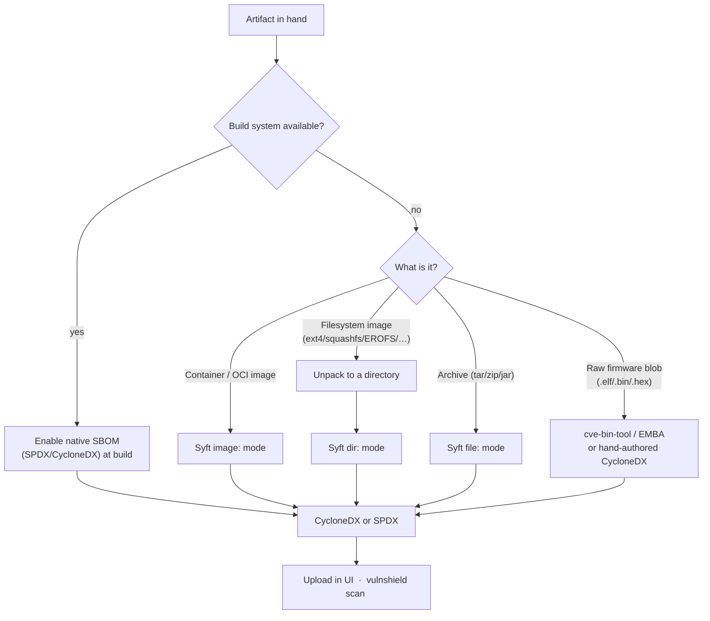
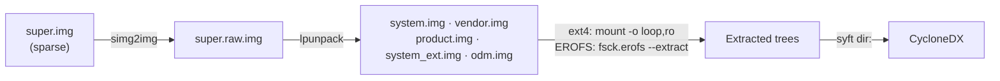

# SBOM & Vulnerability Cataloging Guidelines

Reference for generating SBOMs and running vulnerability scans in **VulnAssesTool** across
the artifact classes we actually deal with: Android images + Linux kernels, embedded Linux
(Yocto), bare-metal/RTOS MCU firmware, and AUTOSAR. Read the **Core Principles** once; then
jump to the relevant **Category Playbook**.

---

## 0. Core Principles (read once)

1. **Prefer a build-time SBOM over post-hoc binary scanning.** Every ecosystem here can emit
   an authoritative SBOM at build time (AOSP SPDX, Yocto `create-spdx`, Zephyr `west spdx`,
   Conan lockfiles). That source knows exact versions, licenses, and patches. Scanning a
   finished binary is a _fallback_ with real blind spots — use it only when you cannot get
   the build to emit an SBOM.

2. **The tool only ingests CycloneDX and SPDX** (JSON or XML). Whatever you do upstream, the
   final artifact fed to the UI upload or `vulnshield scan` must be one of those. Parsers:
   `parseCycloneDX`, `parseSpdx`. There is no other ingestion path.

3. **Matching is CPE-first.** The scanner walks a ladder — explicit CPE → estimated
   `vendor:product` CPE → full name → longest token — and queries NVD by CPE
   (`cli/scanner/localScanner.ts`). Practical consequence: **a component only gets good CVE
   coverage if it carries a version and a CPE/PURL that maps to an NVD CPE.** Native and
   embedded components frequently do not. Treat "0 findings" on a low-quality component as
   **coverage gap → manual review**, never as "clean."

4. **Syft's reach is narrow for our artifacts.** Pinned Syft (v1.44.0) reads filesystems,
   archives, and container images. It does **not** read Android sparse/super/ext4/EROFS
   images, kernel/boot images, or raw MCU firmware. For those you **unpack to a directory
   first**, then scan `dir:`. In the tool, `image` mode means a _container/OCI reference_,
   not an Android/embedded partition image.

5. **Use the right tool per layer** (highest trust first):

   ```mermaid
   flowchart TB
     A["Build-time SBOM<br/>(AOSP SPDX · Yocto create-spdx · Zephyr west spdx · Conan lock)"]:::best
     B["Syft on an extracted filesystem tree<br/>(dir: mode)"]:::good
     C["Firmware binary signature scanner<br/>(cve-bin-tool / EMBA)"]:::ok
     D["Hand-authored, version-controlled CycloneDX<br/>(bare-metal / AUTOSAR BOM)"]:::manual
     A --> B --> C --> D
     classDef best fill:#c8e6c9,stroke:#2e7d32;
     classDef good fill:#dcedc8,stroke:#558b2f;
     classDef ok fill:#fff9c4,stroke:#f9a825;
     classDef manual fill:#ffe0b2,stroke:#ef6c00;
   ```

6. **Kernels and firmware are version-extraction problems, not package-cataloging problems.**
   You extract a version string and track it against advisories; a package cataloger will
   not do this for you.

### The ingestion decision (applies to every category)



---

## 1. Category Playbook — Android images + Linux kernels

### What's in the artifact

A typical AAOS / Android prebuilt image directory (example: i.MX95 eCockpit):

| File                                                 | Contains                                                                                                        | Scan value                                         |
| ---------------------------------------------------- | --------------------------------------------------------------------------------------------------------------- | -------------------------------------------------- |
| `super.img`                                          | **The whole userspace**: `system`, `vendor`, `product`, `system_ext`, `odm` (native libs, binaries, APEX, APKs) | **Primary target** — nearly all scannable software |
| `boot.img`, `init_boot.img`, `vendor_boot.img`       | Linux **kernel** + ramdisks (magic `ANDROID!`)                                                                  | Kernel-CVE only; separate unpack                   |
| `*bootloader*`, `spl-*.bin`, `u-boot-*.imx`          | U-Boot / SPL firmware                                                                                           | Negligible for SBOM                                |
| `dtbo-*.img`, `vbmeta-*.img`, `partition-table*.img` | Device tree, verified-boot metadata, GPT                                                                        | No software content                                |
| `*.tar.gz` tooling bundles                           | Build tooling                                                                                                   | Scannable but low value                            |

`super.img` is an **Android sparse image** (magic `3a ff 26 ed`) wrapping a **super/dynamic
partition**. Syft cannot read it. It must be unpacked.

### Best source — build-time SPDX (do this if you own the build)

Android 14+ emits an SPDX SBOM for the device image at
`out/target/product/<device>/sbom.spdx.json`. This is authoritative (every module, version,
license). **Feed that SPDX directly** — skip the unpack pipeline entirely.

### Fallback — unpack `super.img`, scan as a directory



```bash
simg2img super.img super.raw.img          # android-sdk-libsparse-utils
mkdir parts && lpunpack super.raw.img parts/   # from AOSP otatools
# each partition is ext4 OR EROFS (AAOS 12+ read-only parts are usually EROFS):
#   ext4  -> sudo mount -o loop,ro parts/system.img /mnt/system
#   EROFS -> fsck.erofs --extract=./system_out parts/system.img   # erofs-utils
syft dir:/mnt/system -o cyclonedx-json > system.sbom.json
```

Scan `system`, `vendor`, and `product` at minimum. On Windows, run the unpack in WSL2.
For OTA images (`payload.bin`), use `payload_dumper` first to get the partition images.

### Linux kernel (from the boot images)

```bash
unpack_bootimg --boot_img boot.img --out boot_out/     # AOSP mkbootimg tools
# kernel is a compressed Image; get the version string:
strings boot_out/kernel | grep -m1 "Linux version"
```

Track that kernel version against kernel CVEs separately — it will **not** appear in the
`super.img` scan. Syft's `linux-kernel` cataloger can also identify `vmlinuz` and `.ko`
modules once extracted to a directory.

### Coverage expectations

Syft on an extracted Android tree mainly catches **native binaries with embedded versions**
(openssl, curl, zlib…), Go/Rust build-info binaries, Java jars, and APEX modules. It does
**not** enumerate Android APKs as packages. For a complete Android inventory, the build-time
SPDX is the only authoritative source.

---

## 2. Category Playbook — Embedded Linux (Yocto / OpenEmbedded)

### Best source — build-time, always prefer

- `INHERIT += "create-spdx"` → per-image SPDX in `tmp/deploy/spdx/` (SPDX 2.2; newer Yocto
  emits SPDX 3.0). Authoritative: every recipe, version, license, patch. **Feed this.**
- Complementary at build: `INHERIT += "cve-check"` produces a per-image CVE report mapped
  against NVD. Good cross-check, but for the tool you still feed the **SPDX**.
- Also useful if SPDX isn't enabled: the image `*.manifest` (installed packages + versions)
  and `tmp/deploy/licenses/<image>/{package,license}.manifest`.

### Fallback — only the rootfs image binary

Identify the rootfs format, extract to a directory, then `syft dir:`.

| Rootfs format  | Extract with                               |
| -------------- | ------------------------------------------ |
| ext2/3/4       | `mount -o loop,ro` (or `debugfs` / `e2cp`) |
| squashfs       | `unsquashfs`                               |
| UBI/UBIFS      | `ubireader_extract_files` (ubi_reader)     |
| WIC disk image | `wic ls` then extract partitions           |
| cpio initramfs | `cpio -idmv` (after decompress)            |

**Package-DB gotcha:** Syft catalogs `rpm` (`/var/lib/rpm`) and `dpkg`
(`/var/lib/dpkg/status`). It does **not** natively catalog **opkg** (common on Yocto). If
`PACKAGE_CLASSES` is `package_ipk`, parse `/var/lib/opkg/status` (or `/usr/lib/opkg/status`)
yourself, or fall back to the image `.manifest`.

---

## 3. Category Playbook — Bare-metal / RTOS on small MCUs

This is the hard case: firmware is a statically-linked blob (`.elf`, `.bin`, Intel HEX
`.hex`, `.srec`) with **no filesystem and no package manager**. Syft finds essentially
nothing. The SBOM must come from **build metadata**, and where it can't, from a
**binary signature scanner** or a **hand-authored** BOM.

### Best source — build metadata

| Ecosystem         | SBOM source                                                                                                                                                      |
| ----------------- | ---------------------------------------------------------------------------------------------------------------------------------------------------------------- |
| **Zephyr RTOS**   | `west spdx` (needs `CONFIG_BUILD_OUTPUT_META=y`) → SPDX with every module + source file. Plus the `west.yml` manifest lists module revisions. **Authoritative.** |
| **Conan (C/C++)** | `conan.lock` is gold — exact transitive versions. Syft catalogs `conanfile.txt`/`conan.lock`.                                                                    |
| **vcpkg**         | `vcpkg.json` + manifest baseline.                                                                                                                                |
| **CMake**         | `FetchContent` / `ExternalProject` / CPM (`package-lock.cmake`) pins.                                                                                            |
| **PlatformIO**    | `platformio.ini` `lib_deps`.                                                                                                                                     |
| **Arduino**       | `library.properties`.                                                                                                                                            |

Point Syft at the **source tree** (`syft dir:./src`) to pick up `conan.lock`/manifests, or
generate CycloneDX from Conan directly (`conan graph info ... --format=cyclonedx`).

### Fallback — scan the firmware binary for known components

Use **cve-bin-tool** (Intel) or **EMBA** — signature checkers that fingerprint embedded
components (openssl, zlib, libcurl, busybox, mbedTLS…) inside a blob, then emit
CVEs / an SBOM. Normalize format first:

```bash
objcopy -I ihex -O binary firmware.hex firmware.bin     # .hex/.srec -> raw .bin
cve-bin-tool --sbom-output fw.cdx.json --sbom cyclonedx firmware.bin
```

### Firmware identification helper — `scripts/firmware-catalog.py`

For a raw firmware blob you can't get build metadata for, this emits a CycloneDX that records the
**firmware product version** (from `--version` or the filename) and **identifies which known stacks
are present** by byte signature (FreeRTOS, mbedTLS, lwIP, wolfSSL, FatFs, newlib, …), extracting a
component version only when a real banner exists — usually it doesn't, so those are marked
`vat:coverage=gap` + "advisory-tracked", never falsely clean. Confirmed on real FreeRTOS firmware:
it recovered the firmware version and flagged FreeRTOS/newlib as present-but-unversioned, while
`cve-bin-tool` found **zero** (stripped, no banners). Treat this as a _seed_ to hand-augment with
build-metadata versions, then cross-check with `sbom-diff.py`.

### Last resort — hand-authored CycloneDX

For hand-managed dependency sets, maintain a **version-controlled CycloneDX** enumerating the
third-party stack — RTOS kernel, TCP/IP stack (lwIP…), TLS/crypto (mbedTLS, wolfSSL…), USB
stack, filesystem — each with a **version** and, where one exists, a **CPE**. This is the
realistic path for true bare-metal and the input the tool can actually match against.

---

## 4. Category Playbook — AUTOSAR

AUTOSAR splits into two platforms; treat them differently.

### Adaptive Platform (AP)

Runs on POSIX (usually embedded Linux). **Use the Embedded Linux / Yocto playbook (§2).**
`ara::*` services are ordinary processes in a Linux rootfs — the rootfs SBOM covers them.

### Classic Platform (CP)

Statically-linked BSW on an MCU (Infineon AURIX, NXP S32, Renesas RH850). No package
manager, no filesystem — same shape as bare-metal (§3), but the "components" are BSW modules
from a vendor stack (Vector MICROSAR, EB tresos, ETAS RTA-BSW, Siemens).

**Identify components from configuration, not the binary:**

- Parse **ARXML** `BswModuleDescription` "published information": `vendorId`, `moduleId`,
  `arReleaseVersion` (R20-11 / R21-11 / R22-11), and module `sw*Version` (major/minor/patch).
- Record the **stack + tool version** (e.g., MICROSAR 4.x, tresos <ver>) and the **MCAL**
  version from the silicon vendor.
- Assemble a **CycloneDX** BOM: one component per BSW module + MCAL + any wrapped third-party
  lib (e.g., the crypto primitive behind Csm/CryIf), with supplier, version, and AUTOSAR
  release.

**Coverage reality:** most BSW modules have **no NVD CPE**, so CPE-first matching will not
find much. Drive risk from **vendor PSIRT advisories** (Vector, Elektrobit/EB, ETAS, and the
silicon vendor) keyed on the recorded stack/AUTOSAR versions, and from wrapped crypto libs
that _do_ have CPEs. Mark BSW components as "advisory-tracked, not NVD-matched" so the report
doesn't read as falsely clean.

---

## 5. Component Hygiene (why matches succeed or fail)

The scanner matches CPE-first (`deriveSearchTiers` → `searchCVEsByCPE`), with CPE estimation
via `suggestCPEs` (`src/renderer/lib/utils/cpeUtils.ts`, `cpeEstimationService`). To maximize
real matches and avoid false "clean" results:

- **Always carry a version.** No version → the fixed-version/range logic can't gate, and
  estimation confidence drops.
- **Prefer an explicit `cpe:` or `purl`** on each component. A correct CPE short-circuits the
  estimation ladder and is the strongest signal.
- **Flag un-CPE-able components.** Native/embedded/BSW components with no mappable CPE should
  be surfaced as a **coverage gap**, not silently reported as having no vulnerabilities.
- **Use VEX to suppress triaged findings**, not to hide gaps — `--vex <file>` /
  `vexParser.ts` (`not_affected` / `resolved` only).

---

## 6. Feeding results into VulnAssesTool

- **UI:** SBOM upload dialog (CycloneDX/SPDX). For a container image, the SBOM-from-binary
  flow can call Syft in `image` mode.
- **Android images (automated §1 fallback):** in the SBOM-from-binary dialog's **Local path**
  mode, pointing at an Android prebuilt-image _directory_ (one containing `super.img`/`boot.img`)
  is auto-detected and unpacked before scanning — `simg2img → lpunpack → EROFS/ext4 extract →
syft dir:` — and the `boot.img` kernel version is added as a `linux_kernel` component. The
  unpack runs in Linux; on Windows the server drives it through **WSL2**
  (`scripts/unpack-android-image.sh` + `scripts/lpunpack.py`, tools self-provisioned).
- **Maximizing native recall (`scripts/android-catalog.py`).** Stock Syft only catalogs natives
  that carry a recognized version banner, which stripped Android binaries usually don't (toybox,
  BoringSSL `libcrypto`/`libssl`, …). To avoid a falsely-clean report the catalog step merges:
  Syft **∪** an **exhaustive ELF inventory** (every executable/`.so`/`.ko`) **∪** **curated
  string-probes** for high-value natives Syft misses (`toybox`, `zlib`, `libpng`, `sqlite`, `expat`,
  `pcre2`, `curl`, `freetype` → real version + CPE) **∪** **APK/APEX manifest versions** (each
  `AndroidManifest.xml` `versionName` and `apex_manifest` version — the app inventory Syft can't
  produce, extracted statically without booting). Each component records `vat:source` provenance and
  `vat:coverage` (`identified`/`gap`). **Default output = versioned + known third-party libs**
  (clean, CVE-actionable); set `VAT_FULL_INVENTORY=1` to emit _every_ framework/vendor binary for a
  full audit. `cve-bin-tool` can be merged (`VAT_ENABLE_CBT=1`) but is **off by default** — proven
  slow (~1 s/file) and ~zero-yield on stripped Android natives; keep it for the firmware case (§3).
- **Cross-checking an untrusted supplier SBOM (`scripts/sbom-diff.py`).** Because a supplier's SBOM
  can be incomplete (accidentally, or to hide a CVE), diff it against the image-derived catalog:
  `sbom-diff.py --supplier <their.sbom.json> --image <catalog.json>` lists components present in the
  image but **missing from the supplier's SBOM** (exit 3 if any) — the things to scrutinize.
- **CLI / CI:** `vulnshield scan <sbom> --format sarif --fail-on high` (see `cli/index.ts`
  for all flags and exit codes). Use `vulnshield diff <old> <new>` to gate on newly
  introduced components between builds.

---

## 7. Quick reference — tool per artifact

| Artifact                  | Prep                                               | Then                                        |
| ------------------------- | -------------------------------------------------- | ------------------------------------------- |
| Android `super.img`       | `simg2img` → `lpunpack` → mount/extract ext4/EROFS | `syft dir:` → CycloneDX                     |
| Android `boot.img`        | `unpack_bootimg` → read kernel version             | Track kernel CVEs separately                |
| Android (own build)       | —                                                  | Feed `sbom.spdx.json`                       |
| Yocto image (own build)   | `INHERIT += "create-spdx"`                         | Feed `tmp/deploy/spdx/*`                    |
| Yocto rootfs binary       | unsquashfs / mount / ubi_reader                    | `syft dir:` (mind opkg gap)                 |
| Zephyr firmware           | `west spdx`                                        | Feed SPDX                                   |
| MCU firmware (no build)   | `objcopy` to `.bin`                                | `cve-bin-tool` → CycloneDX                  |
| Bare-metal (managed deps) | —                                                  | Hand-authored CycloneDX                     |
| AUTOSAR Adaptive          | (Linux rootfs)                                     | See Yocto playbook                          |
| AUTOSAR Classic           | Parse ARXML module versions                        | Hand-authored CycloneDX + vendor advisories |
